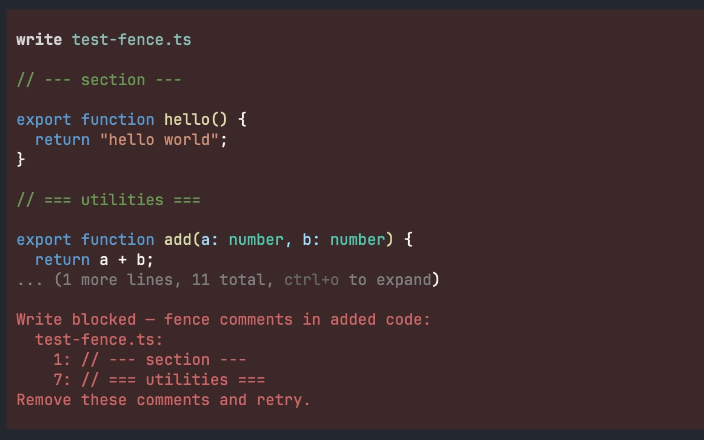

# pi-fence

A [pi coding agent](https://github.com/earendil-works/pi) extension that detects decorative fence/divider comments in code written by the model and warns, blocks, or removes them automatically.



## What it catches

Comments whose inner text (after stripping `//`, `#`, `/* */` markers) contains a sequence of 3 or more separator characters:

```ts
// ---- helpers ----        ← caught
// ===== Auth Module =====  ← caught
# ################          ← caught
/* ~~~ utilities ~~~ */     ← caught
// ────────────────         ← caught (Unicode box-drawing)

// TODO: fix this           ← NOT caught
// Copyright (c) 2024       ← NOT caught
```

## Supported languages

| Extension(s) | Language |
|---|---|
| `.ts`, `.tsx`, `.cts`, `.mts` | TypeScript |
| `.js`, `.jsx`, `.mjs`, `.cjs` | JavaScript |
| `.py` | Python |
| `.go` | Go |
| `.rs` | Rust |
| `.rb` | Ruby |
| `.java` | Java |
| `.sh`, `.bash` | Shell / Bash |
| `.c`, `.h` | C |
| `.css` | CSS |

Files with other extensions are passed through without inspection.

## Install

```bash
pi install npm:pi-fence
```

## Modes

Control via the `--pi-fence-mode` CLI flag (takes precedence) or the `PI_FENCE_MODE` environment variable:

```bash
pi --pi-fence-mode warn    # default: write proceeds, warning shown to model
pi --pi-fence-mode block   # write is blocked; model must remove fences and retry
pi --pi-fence-mode remove  # fence comments are stripped silently before writing

PI_FENCE_MODE=block pi    # same, via env variable
```

## How it works

1. Injects a short system-prompt instruction telling the model not to add fence comments.
2. On every `write` and `edit` tool call, parses the new content with [tree-sitter](https://tree-sitter.github.io/) to extract comment nodes.
3. Compares against the existing file — only **newly introduced** fences trigger (a fence at the same line as in the old file is not re-reported).
4. Acts according to the configured mode.

## System-Prompt
> Do not insert decorative fence comments like // ---- section ----.
> Code-smell, if needed, extract to function or file instead. 

## Development

```bash
pnpm install
pnpm test
pnpm typecheck
pnpm check
```

To test changes manually, pass the source entry point directly to pi with the `-e` flag:

```bash
pi -ne -e src/index.ts
pi -ne -e src/index.ts --pi-fence-mode block
pi -ne -e src/index.ts --pi-fence-mode remove
```
